# 2. Analysis

<h2 align="center">
Mylog
</h2>

<!--logo-->

<h4 align="right">
22421702, 최유정, sayyj0406@yu.ac.kr
</h4>

---
<h3 align="center">
[Revision history] 
</h3>

|Revision date | Version # | Description | Author |
|-|-|-|-|
|05/08/2026| 0.00 | First Documentation | 최유정 |
---

<h3 align="center">
= Contents =
</h3>

1. Introduction
2. Use case analysis
3. Domain analysis
4. User Interface prototype
5. Glossary
6. References

---
# 1. Business purpose
최근 일상생활의 많은 부분이 디지털 환경으로 전환되면서, 아날로그 방식의 기록 문화는 점차 감소하는 추세를 보이고 있다. 이에 따라 일기나 루틴등 개인 기록을 꾸준히 기록하고 관리하는 것이 점점 어려워지고 있다. 이러한 변화 속에서, 개인의 기록들을 보다 효율적이고 편리하게 관리할 수 있는 디지털 도구가 필요하다 생각되어 다양한 기록을 한 번에 관리할 수 있는 디지털 기록 프로그램을 만들고자 한다.

본 문서는 conceptualization 단계의 문서와 이어지는 Analysis 단계의 문서로 use case와  domain분석과 user interface prototype에 대해 정리하고자한다.

# 2. Use case analysis
## Use Case Diagram
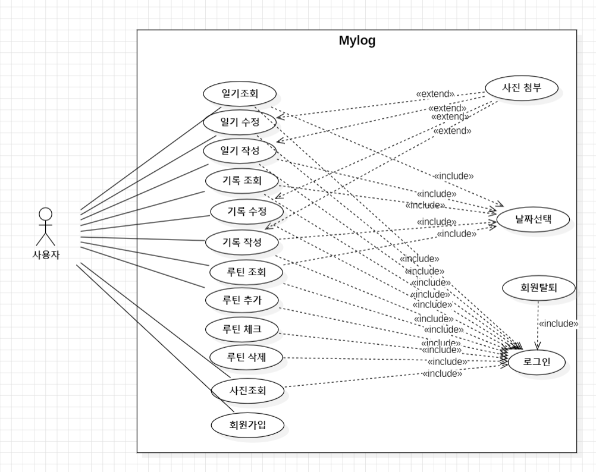

## Use Case Description
### Use case #1 : Sign up
**General Characteristics** 

Summary : 사용자가 앱 사용을 위해 회원가입을 할 때 사용하는 기능  
Scope : Mylog  
Level : User level  
Author : 최유정  
Last Update : 2026.05.08.  
Status : Analysis  
Primary Actor : 사용자  
Preconditions : 앱이 설치되어 있어야 하고, 통신이 가능한 상태여야한다.  
Trigger : 로그인 페이지에서 회원가입 버튼을 눌러 회원가입을 하려고 할 때  
Success Post Condition : 사용자는 회원가입을 할 수 있다.  
Failed Post Condition : 사용자는 회원가입을 할 수 없다.  

**Main Success Scenario**
|Step|Action|
|-|-|
|S|사용자가 회원가입 한다.|
|1|이 Use Case는 사용자가 회원가입을 하려고 할 때 시작된다.|
|2|회원은 로그인 페이지에서 회원가입 버튼을 누른다.|
|3|시스템은 회원가입 페이지를 띄운다.|
|4|회원은 정보를 입력하고 회원가입 버튼을 누른다.|
|5|시스템은 회원가입이 성공한지 판단한다.|
|6|이 Use Case는 회원가입이 성공하면 끝난다.|

**Extension Scenarios**
|Step |Branching Actions|
|-|-|
|3|2a 이미 존재하는 회원일 경우.   2a.1. 존재하는 회원이라고 창을 띄운다.   2a.2. 사용자가 확인버튼을 누르면 로그인 화면으로 돌아간다. (Use Case #2-2)|

**Related Information**

Performance : < 1 second  
Frequency : 사용자당 1번  
Concurrency : 제한 없음  
Due Date : 2026.06.15.  

---

### Use case #2 : Sign in
**General Characteristics**

Summary : 사용자가 앱 사용을 위해 로그인을 할 때 사용하는 기능  
Scope : Mylog  
Level : User level  
Author : 최유정  
Last Update : 2026.05.08.  
Status : Analysis  
Primary Actor : 사용자  
Preconditions : 앱이 설치되어 있어야 하고, 통신이 가능한 상태여야한다. 회원가입이 되어있어야 한다.  
Trigger : 로그인 페이지에서 아이디와 비밀번호를 치고 로그인 하려고 할 때  
Success Post Condition : 사용자는 로그인을 할 수 있다.  
Failed Post Condition : 사용자는 로그인을 할 수 없다.  

**main success Scenario**
|Step| Action|
|-|-|
|S|사용자가 로그인한다.|
|1|이 Use Case는 사용자가 로그인 하려고 할 때 시작된다.|
|2|회원은 로그인 페이지에서 아이디와 비밀번호를 적고 로그인 버튼을 누른다.|
|3|시스템은 아이디가 존재하는지 확인한다.|
|4|시스템은 아이디와 비밀번호가 일치하는지 확인한다.|
|5|이 Use Case는 로그인이 성공하면 끝난다.|

**Extension scenarios**
|Step | Branching Actions|
|-|-|
|3| 3a. 아이디가 존재하지 않아 로그인에 실패한다.   3a.1.존재하지 않는 아이디라는 메세지를 띄운다.   3a.2. 사용자가 확인버튼을 누르면 아이디와 비밀번호를 입력하는 단계로 돌아간다. (Use Case #2-2)|
|4| 4.a. 비밀번호가 일치하지 않아 로그인에 실패한다.   4a.1. 비밀번호가 일치하지 않는다는 메세지를 띄운다.   4a.2. 사용자가 확인버튼을 누르면 비밀번호 입력창을 초기화하고 입력단계로 돌아간다. (Use Case #2-2)|

**Related Information**

Performance : < 2 second  
Frequency : 회원당 하루에 평균 2번  
Concurrency : 제한없음  
Due Date : 2026.06.15.  

---

### Use case #3 : 일기작성
**General Characteristics**  
Summary : 사용자가 일기를 작성하고자 할 때 사용하는 기능   
Scope : Mylog  
Level : User level  
Author : 최유정  
Last Update : 2026.05.08.  
Status : Analysis  
Primary Actor : 사용자  
Preconditions : 앱이 설치되어 있어야 하고, 통신이 가능한 상태여야한다. 로그인이 되어있어야 한다. 
Trigger : 메인 화면에서 일기를 쓰려고 할 때  
Success Post Condition : 시스템은 일기를 저장할 수 있다.  
Failed Post Condition : 시스템은 일기를 저장할 수 없다.  

**Main Success Scenario**
|Step| Action|
|-|-|
|S|사용자가 일기를 작성한다.|
|1|이 Use Case는 사용자가 일기를 작성하려고 할 때 시작된다.
|2|회원은 메인화면에서 일기 버튼을 누른다.|
|3|시스템은 일기 페이지를 띄운다.|
|4|사용자는 일기 페이지에서 일기 작성 버튼을 누른다.|
|5|시스템은 일기 작성 페이지를 띄운다.|
|6|사용자는 일기를 작성하고 저장버튼을 누른다.|
|7|시스템은 일기를 데이터베이스에 저장한다.|
|8|이 Use Case는 일기를 저장하면 종료한다.|

**Extension Scenarios**
|Step | Branching Actions|
|-|-|
|4|4a. 이미 당일 일기가 존재할 경우   4a.1. 일기를 수정할 것인지 묻는 메세지를 띄운다.   4a.2.a 사용자가 확인 버튼을 누를 경우 수정할 페이지를 띄운다. (Use Case #5-5)   4a.2.b 사용자가 취소 버튼을 누를 경우 일기 페이지로 돌아간다. (Use Case #4-3)|
|6|6a. 사용자가 저장버튼을 누르지 않고 이전화면으로 나가려고 할 경우   6a.1 내용을 삭제하고 이전화면으로 나간다는 메세지를 띄운다.   6a.2 사용자가 확인버튼을 누르면 일기 페이지를 띄운다. (Use Case #4-3)|
|7|7a. 통신문제로 저장 실패하는 경우   7a.1 저장 실패 메세지를 띄운다.   7a.2 사용자가 확인버튼을 누르면 일기 작성 페이지를 띄운다. (Use Case #3-5)|

**Related Information**  
Performance : < 5 second  
Frequency : 회원당 하루 평균 2번  
Concurrency : 제한없음  
Due Date : 2026.06.15  

---

### Use case #4 : 일기 조회
**General Characteristics**  
Summary : 사용자가 일기를 조회할 때 사용하는 기능   
Scope : Mylog  
Level : User level  
Author : 최유정  
Last Update : 2026.05.08.  
Status : Analysis  
Primary Actor : 사용자  
Preconditions : 앱이 설치되어 있어야 하고, 통신이 가능한 상태여야한다. 로그인이 되어있는 상태여야한다.  
Trigger : 메인화면에서 일기를 조회하려고 할 때  
Success Post Condition : 시스템은 일기를 조회할 수 있다.  
Failed Post Condition : 시스템은 일기를 조회할 수 없다.  

**Main Success Scenario**
|Step| Action|
|-|-|
|S|사용자가 일기를 조회한다.|
|1|이 Use Case는 사용자가 일기를 조회하려고 할 때 시작된다.|
|2|사용자는 메인화면에서 일기 버튼을 누른다.|
|3|시스템은 일기 페이지를 띄운다.|
|4|사용자는 조회할 날짜를 선택한다.|
|5|시스템은 선택한 날짜의 정보를 조회한다.|
|6|이 Use Case는 일기조회가 성공하면 끝난다.|

**Extension Scenarios**
|Step | Branching Actions|
|-|-|
|5|5a. 통신의 문제로 조회를 실패하는 경우   5a.1 조회 실패 메세지를 띄운다.   5a.2 사용자가 확인버튼을 누르면 일기 페이지로 돌아간다. (Use Case #4-3)     5b. 해당 날짜의 일기가 존재하지 않을 경우   5b.1 해당 날짜의 일기가 존재하지 않는다는 메세지를 띄운다.   5b.2 사용자가 확인 버튼을 누르면 일기 페이지로 돌아간다. (Use Case #4-3)|

**Related Information**  
Performance : < 2 second  
Frequency : 회원당 하루에 평균 3~5번  
Concurrency : 제한없음  
Due Date : 2026.06.15.  

---

### Use case #5 : 일기 수정
**General Characteristics**  
Summary : 사용자가 일기를 수정할 때 사용하는 기능   
Scope : Mylog  
Level : User level  
Author : 최유정  
Last Update : 2026.05.08.  
Status : Analysis  
Primary Actor : 사용자  
Preconditions : 앱이 설치되어 있어야 하고, 통신이 가능한 상태여야한다. 로그인이 되어있는 상태여야한다. 작성된 일기가 있어야 한다.  
Trigger : 일기 페이지에서 일기를 수정하고자 할 때  
Success Post Condition : 시스템은 수정내용을 저장할 수 있다.  
Failed Post Condition : 시스템은 수정내용을 저장할 수 없다.  

**Main Success Scenario**
|Step| Action|
|-|-|
|S|사용자가 일기를 수정한다.|
|1|이 Use Case는 사용자가 일기를 수정하려고 할 때 시작된다.|
|2|사용자는 메인화면에서 일기 버튼을 누른다.|
|3|시스템은 일기 페이지를 띄운다.|
|4|사용자는 수정할 일기를 선택한다.|
|5|시스템은 선택한 일기를 조회한다.|
|6|사용자는 일기를 수정한 후 저장버튼을 누른다.|
|7|시스템은 일기를 데이터베이스에 저장한다.|
|8|이 Use Case는 일기 수정이 성공하면 끝난다.|

**Extension Scenarios**
|Step | Branching Actions|
|-|-|
|6|6a. 사용자가 저장버튼을 누르지 않고 이전화면으로 나가려고 할 경우   6a.1 내용을 삭제하고 메인화면으로 나간다는 메세지를 띄운다.   6a.2 사용자가 확인버튼을 누르면 일기 페이지를 띄운다. (Use Case #4-3)|
|7|7a. 통신문제로 저장 실패하는 경우   7a.1 저장 실패 메세지를 띄운다.   7a.2 사용자가 확인버튼을 누르면 일기 수정 페이지를 띄운다. (Use Case #5-6)|

**Related Information**  
Performance : < 5 second  
Frequency : 회원당 하루에 평균 2번  
Concurrency : 제한없음  
Due Date : 2026.06.15.  

---

### Use case #6 : 기록 작성
**General Characteristics**  
Summary : 사용자가 기록을 작성할 때 사용하는 기능   
Scope : Mylog  
Level : User level  
Author : 최유정  
Last Update : 2026.05.08.  
Status : Analysis  
Primary Actor : 사용자  
Preconditions : 앱이 설치되어 있어야 하고, 통신이 가능한 상태여야한다. 로그인이 되어있는 상태여야한다.  
Trigger : 메인화면에서 기록을 작성하고자 할 때  
Success Post Condition : 시스템은 기록을 저장할 수 있다.  
Failed Post Condition : 시스템은 기록을 저장할 수 없다.  

**Main Success Scenario**
|Step| Action|
|-|-|
|S|사용자가 기록을 작성한다.|
|1|이 Use Case는 사용자가 기록을 작성하려고 할 때 시작된다.
|2|회원은 메인화면에서 기록 버튼을 누른다.|
|3|시스템은 기록 페이지를 띄운다.|
|4|사용자는 기록 페이지에서 일기 작성 버튼을 누른다.|
|5|시스템은 기록 작성 페이지를 띄운다.|
|6|사용자는 기록을 작성하고 저장버튼을 누른다.|
|7|시스템은 기록을 데이터베이스에 저장한다.|
|8|이 Use Case는 기록을 저장하면 종료한다.|

**Extension Scenarios**
|Step | Branching Actions|
|-|-|
|6|6a. 사용자가 저장버튼을 누르지 않고 이전화면으로 나가려고 할 경우   6a.1 내용을 삭제하고 이전화면으로 나간다는 메세지를 띄운다.   6a.2 사용자가 확인버튼을 누르면 기록 페이지를 띄운다. (Use Case #6-3)|
|7|7a. 통신문제로 저장 실패하는 경우   7a.1 저장 실패 메세지를 띄운다.   7a.2 사용자가 확인버튼을 누르면 기록 작성 페이지를 띄운다. (Use Case #6-5)|

**Related Information**  
Performance : < 5 second  
Frequency : 회원당 하루에 평균 3번  
Concurrency : 제한없음  
Due Date : 2026.06.15.  

---

### Use case #7 : 기록 조회-카테고리
**General Characteristics**  
Summary : 사용자가 기록을 카테고리로 조회할 때 사용하는 기능   
Scope : Mylog  
Level : User level  
Author : 최유정  
Last Update : 2026.05.08.  
Status : Analysis  
Primary Actor : 사용자  
Preconditions : 앱이 설치되어 있어야 하고, 통신이 가능한 상태여야한다. 로그인이 되어있는 상태여야한다.  
Trigger : 메인화면에서 기록을 조회하려고 할 때  
Success Post Condition : 시스템은 기록을 조회할 수 있다.  
Failed Post Condition : 시스템은 기록을 조회할 수 없다.  

**Main Success Scenario**
|Step| Action|
|-|-|
|S|사용자가 기록을 조회한다.|
|1|이 Use Case는 사용자가 기록을 조회하려고 할 때 시작된다.|
|2|사용자는 메인화면에서 기록 버튼을 누른다.|
|3|시스템은 기록 페이지를 띄운다.|
|4|사용자는 조회할 카테고리를 선택한다.|
|5|시스템은 선택한 카테고리의 정보를 조회한다.|
|6|이 Use Case는 기록조회가 성공하면 끝난다.|

**Extension Scenarios**
|Step | Branching Actions|
|-|-|
|5|5a. 통신의 문제로 조회를 실패하는 경우   5a.1 조회 실패 메세지를 띄운다.   5a.2 사용자가 확인버튼을 누르면 기록 페이지로 돌아간다. (Use Case #7-3)|

**Related Information**  
Performance : < 2 second  
Frequency : 회원당 하루에 평균 3~5번  
Concurrency : 제한없음  
Due Date : 2026.06.15.  

---

### Use case #8 : 기록 조회-날짜
**General Characteristics**  
Summary : 사용자가 기록을 날짜로 조회할 때 사용하는 기능   
Scope : Mylog  
Level : User level  
Author : 최유정  
Last Update : 2026.05.08.  
Status : Analysis  
Primary Actor : 사용자  
Preconditions : 앱이 설치되어 있어야 하고, 통신이 가능한 상태여야한다. 로그인이 되어있는 상태여야한다.  
Trigger : 메인화면에서 기록을 조회하려고 할 때  
Success Post Condition : 시스템은 기록을 조회할 수 있다.  
Failed Post Condition : 시스템은 기록을 조회할 수 없다.  

**Main Success Scenario**
|Step| Action|
|-|-|
|S|사용자가 기록을 조회한다.|
|1|이 Use Case는 사용자가 기록을 조회하려고 할 때 시작된다.|
|2|사용자는 메인화면에서 기록 버튼을 누른다.|
|3|시스템은 기록 페이지를 띄운다.|
|4|사용자는 조회할 날짜를 선택한다.|
|5|시스템은 선택한 날짜의 정보를 조회한다.|
|6|이 Use Case는 기록조회가 성공하면 끝난다.|

**Extension Scenarios**
|Step | Branching Actions|
|-|-|
|5|5a. 통신의 문제로 조회를 실패하는 경우   5a.1 조회 실패 메세지를 띄운다.   5a.2 사용자가 확인버튼을 누르면 기록 페이지로 돌아간다. (Use Case #8-3)     5b. 해당 날짜의 기록이 존재하지 않을 경우   5b.1 해당 날짜의 기록이 존재하지 않는다는 메세지를 띄운다.   5b.2 사용자가 확인 버튼을 누르면 기록 페이지로 돌아간다. (Use Case #8-3)|

**Related Information**  
Performance : < 2 second  
Frequency : 회원당 하루에 평균 3~5번  
Concurrency : 제한없음  
Due Date : 2026.06.15.  

---

### Use case #9 : 기록 수정
**General Characteristics**  
Summary : 사용자가 기록을 수정할 때 사용하는 기능   
Scope : Mylog  
Level : User level  
Author : 최유정  
Last Update : 2026.05.08.  
Status : Analysis  
Primary Actor : 사용자  
Preconditions : 앱이 설치되어 있어야 하고, 통신이 가능한 상태여야한다. 로그인이 되어있는 상태여야한다. 작성된 기록이 있어야 한다.  
Trigger : 기록 페이지에서 기록을 수정하고자 할 때  
Success Post Condition : 시스템은 수정내용을 저장할 수 있다.  
Failed Post Condition : 시스템은 수정내용을 저장할 수 없다.  

**Main Success Scenario**
|Step| Action|
|-|-|
|S|사용자가 기록을 수정한다.|
|1|이 Use Case는 사용자가 기록을 수정하려고 할 때 시작된다.|
|2|사용자는 메인화면에서 기록 버튼을 누른다.|
|3|시스템은 기록 페이지를 띄운다.|
|4|사용자는 수정할 기록을 선택한다.|
|5|시스템은 선택한 기록을 조회한다.|
|6|사용자는 기록을 수정한 후 저장버튼을 누른다.|
|7|시스템은 수정된 기록을 데이터베이스에 저장한다.|
|8|이 Use Case는 기록 수정이 성공하면 끝난다.|

**Extension Scenarios**
|Step | Branching Actions|
|-|-|
|6|6a. 사용자가 저장버튼을 누르지 않고 이전화면으로 나가려고 할 경우   6a.1 내용을 삭제하고 이전 화면으로 나간다는 메세지를 띄운다.   6a.2 사용자가 확인버튼을 누르면 기록 페이지를 띄운다. (Use Case #9-3)|
|7|7a. 통신문제로 저장 실패하는 경우   7a.1 저장 실패 메세지를 띄운다.   7a.2 사용자가 확인버튼을 누르면 기록 수정 페이지를 띄운다. (Use Case #9-6)|

**Related Information**  
Performance : < 5 second  
Frequency : 회원당 하루에 평균 2번  
Concurrency : 제한없음  
Due Date : 2026.06.15.  

---

### Use case #10 : 사진조회
**General Characteristics**  
Summary : 사용자가 사진을 조회할 때 사용하는 기능   
Scope : Mylog  
Level : User level  
Author : 최유정  
Last Update : 2026.05.08.  
Status : Analysis  
Primary Actor : 사용자  
Preconditions : 앱이 설치되어 있어야 하고, 통신이 가능한 상태여야한다. 로그인이 되어있는 상태여야한다.  
Trigger : 메인화면에서 사진을 조회하려고 할 때  
Success Post Condition : 시스템은 사진을 조회할 수 있다.  
Failed Post Condition : 시스템은 사진을 조회할 수 없다.  

**Main Success Scenario**
|Step| Action|
|-|-|
|S|사용자가 사진을 조회한다.|
|1|이 Use Case는 사용자가 사진을 조회하려고 할 때 시작된다.|
|2|사용자는 메인화면에서 사진첩 버튼을 누른다.|
|3|시스템은 사진첩 페이지를 띄운다.|
|4|이 Use Case는 사진 조회가 성공하면 끝난다.|

**Extension Scenarios**
|Step | Branching Actions|
|-|-|
|3|3a. 통신의 문제로 조회를 실패하는 경우   3a.1 조회 실패 메세지를 띄운다.   3a.2 사용자가 확인버튼을 누르면 메인화면으로 돌아간다. (Use Case #10-1)|

**Related Information**  
Performance : < 5 second  
Frequency : 회원당 하루에 평균 3~5번  
Concurrency : 제한없음  
Due Date : 2026.06.15.  

---

### Use case #11 : 루틴 체크
**General Characteristics**  
Summary : 사용자가 루틴 완료 기록을 할 때 사용하는 기능   
Scope : Mylog  
Level : User level  
Author : 최유정  
Last Update : 2026.05.08.  
Status : Analysis  
Primary Actor : 사용자  
Preconditions : 앱이 설치되어 있어야 하고, 통신이 가능한 상태여야한다. 로그인이 되어있는 상태여야한다.  
Trigger : 메인화면에서 루틴 완료 기록을 하려고 할 때  
Success Post Condition : 시스템은 루틴 완료 기록을 할 수 있다.  
Failed Post Condition : 시스템은 루틴 완료 기록을 할 수 없다.  

**Main Success Scenario**
|Step| Action|
|-|-|
|S|사용자가 루틴 완료 기록을 한다.|
|1|이 Use Case는 사용자가 루틴 완료 기록을 하려고 할 때 시작된다.|
|2|사용자는 메인화면에서 완료한 루틴을 찾아 체크버튼을 누른다.|
|3|시스템은 체크된 루틴을 저장한다.|
|4|이 Use Case는 루틴 완료 기록을 한 후 끝난다.|

**Extension Scenarios**
|Step | Branching Actions|
|-|-|
|3|3a. 통신의 문제로 저장을 실패하는 경우   3a.1 저장 실패 메세지를 띄운다.   3a.2 사용자가 확인버튼을 누르면 메인화면으로 돌아간다. (Use Case #11-1)|

**Related Information**  
Performance : < 2 second  
Frequency : 회원당 하루에 평균 3~7번  
Concurrency : 제한없음  
Due Date : 2026.06.15.  

---

### Use case #12 : 루틴 추가
**General Characteristics**  
Summary : 사용자가 루틴을 추가하고자 할 때 사용하는 기능   
Scope : Mylog  
Level : User level  
Author : 최유정  
Last Update : 2026.05.08.  
Status : Analysis  
Primary Actor : 사용자  
Preconditions : 앱이 설치되어 있어야 하고, 통신이 가능한 상태여야한다. 로그인이 되어있어야 한다. 
Trigger : 메인 화면에서 루틴을 추가하려고 할 때  
Success Post Condition : 시스템은 추가된 루틴을 저장할 수 있다.  
Failed Post Condition :시스템은 추가된 루틴을 저장할 수 없다.  

**Main Success Scenario**
|Step| Action|
|-|-|
|S|사용자가 루틴을 추가한다.|
|1|이 Use Case는 사용자가 루틴을 추가하고자 할 때 시작된다.
|2|회원은 메인화면에서 루틴 버튼을 누른다.|
|3|시스템은 루틴 페이지를 띄운다.|
|4|사용자는 루틴 페이지에서 루틴 추가 버튼을 누른다.|
|5|시스템은 루틴 추가 페이지를 띄운다.|
|6|사용자는 루틴을 추가하고 저장버튼을 누른다.|
|7|시스템은 추가된 루틴을 데이터베이스에 저장한다.|
|8|이 Use Case는 추가된 루틴을 저장하면 종료한다.|

**Extension Scenarios**
|Step | Branching Actions|
|-|-|
|6|6a. 사용자가 저장버튼을 누르지 않고 이전화면으로 나가려고 할 경우   6a.1 내용을 삭제하고 이전화면으로 나간다는 메세지를 띄운다.   5a.2 사용자가 확인버튼을 누르면 루틴 페이지를 띄운다. (Use Case #12-3)|
|7|7a. 통신문제로 저장 실패하는 경우   7a.1 저장 실패 메세지를 띄운다.   7a.2 사용자가 확인버튼을 누르면 루틴 추가 페이지를 띄운다. (Use Case #12-5)|

**Related Information**  
Performance : < 2 second  
Frequency : 회원당 하루 평균 2번  
Concurrency : 제한없음  
Due Date : 2026.06.15  

---

### Use case #13 : 루틴 삭제
**General Characteristics**  
Summary : 사용자가 루틴을 삭제할 때 사용하는 기능   
Scope : Mylog  
Level : User level  
Author : 최유정  
Last Update : 2026.05.08.  
Status : Analysis  
Primary Actor : 사용자  
Preconditions : 앱이 설치되어 있어야 하고, 통신이 가능한 상태여야한다. 로그인이 되어있는 상태여야한다. 작성된 루틴이 있어야 한다.  
Trigger : 메인화면에서 루틴을 삭제하고자 할 때  
Success Post Condition : 시스템은 삭제 정보를 저장할 수 있다.  
Failed Post Condition : 시스템은 삭제 정보를 저장할 수 없다.  

**Main Success Scenario**
|Step| Action|
|-|-|
|S|사용자가 루틴을 삭제한다.|
|1|이 Use Case는 사용자가 루틴을 삭제하려고 할 때 시작된다.|
|2|사용자는 메인화면에서 루틴 버튼을 누른다.|
|3|시스템은 루틴 페이지를 띄운다.|
|4|사용자는 삭제할 루틴을 선택한다.|
|5|시스템은 삭제 정보를 데이터베이스에 저장한다.|
|6|이 Use Case는 루틴 삭제가 성공하면 끝난다.|

**Extension Scenarios**
|Step | Branching Actions|
|-|-|
|5|5a. 통신문제로 저장 실패하는 경우   5a.1 저장 실패 메세지를 띄운다.   5a.2 사용자가 확인버튼을 누르면 일기 수정 페이지를 띄운다. (Use Case #13-3)|

**Related Information**  
Performance : < 2 second  
Frequency : 회원당 하루에 평균 2번  
Concurrency : 제한없음  
Due Date : 2026.06.15.  

---

### Use case #14 : 루틴 조회
**General Characteristics**  
Summary : 사용자가 루틴을 조회할 때 사용하는 기능   
Scope : Mylog  
Level : User level  
Author : 최유정  
Last Update : 2026.05.08.  
Status : Analysis  
Primary Actor : 사용자  
Preconditions : 앱이 설치되어 있어야 하고, 통신이 가능한 상태여야한다. 로그인이 되어있는 상태여야한다.  
Trigger : 메인화면에서 루틴을 조회하려고 할 때  
Success Post Condition : 시스템은 루틴을 조회할 수 있다.  
Failed Post Condition : 시스템은 루틴을 조회할 수 없다.  

**Main Success Scenario**
|Step| Action|
|-|-|
|S|사용자가 루틴을 조회한다.|
|1|이 Use Case는 사용자가 루틴을 조회하려고 할 때 시작된다.|
|2|사용자는 메인화면에서 루틴 버튼을 누른다.|
|3|시스템은 루틴 페이지를 띄운다.|
|4|이 Use Case는 루틴 조회가 성공하면 끝난다.|

**Extension Scenarios**
|Step | Branching Actions|
|-|-|
|3|3a. 통신의 문제로 조회를 실패하는 경우   3a.1 조회 실패 메세지를 띄운다.   3a.2 사용자가 확인버튼을 메인화면으로 돌아간다. (Use Case #14-1)|

**Related Information**  
Performance : < 2 second  
Frequency : 회원당 하루에 평균 3~5번  
Concurrency : 제한없음  
Due Date : 2026.06.15.  

---

### Use case #15 : 회원 탈퇴
**General Characteristics**  
Summary : 사용자가 회원 탈퇴를 원할 때 사용하는 기능   
Scope : Mylog  
Level : User level  
Author : 최유정  
Last Update : 2026.05.08.  
Status : Analysis  
Primary Actor : 사용자  
Preconditions : 앱이 설치되어 있어야 하고, 통신이 가능한 상태여야한다. 로그인이 되어있는 상태여야한다.  
Trigger : 메인화면에서 회원 탈퇴를 하려고 할 때  
Success Post Condition : 사용자는 회원 탈퇴를 할 수 있다.  
Failed Post Condition : 사용자는 회원 탈퇴를 할 수 없다.  

**Main Success Scenario**
|Step| Action|
|-|-|
|S|사용자가 회원 탈퇴한다.|
|1|이 Use Case는 사용자가 회원 탈퇴를 하려고 할 때 시작된다.|
|2|사용자는 메인화면에서 설정 버튼을 누른다.|
|3|시스템은 설정 창을 띄운다.|
|4|설정 메뉴 중 회원 탈퇴 버튼을 누른다.|
|5|시스템은 비밀번호 확인 창을 띄운다.|
|6|사용자는 비밀번호를 입력한다.|
|7|시스템은 사용자 아이디와 입력된 비밀번호가 일치하는지 확인한다.|
|8|시스템은 탈퇴 여부를 묻는 메세지를 띄운다.|
|9|사용자는 확인버튼을 누른다.|
|10|시스템은 회원의 정보를 지운다.|
|11|시스템은 로그인 화면을 띄운다.|
|12|이 Use Case는 회원 탈퇴가 성공하면 끝난다.|

**Extension Scenarios**
|Step | Branching Actions|
|-|-|
|7|7a. 비밀번호가 일치하지 않아 회원 탈퇴에 실패한다.   7a.1. 비밀번호가 일치하지 않는다는 메세지를 띄운다.   7a.2. 사용자가 확인버튼을 누르면 비밀번호 입력창을 초기화하고 비밀번호 입력단계로 돌아간다. (Use Case #15-6)|
|8|8a. 사용자가 취소 버튼을 누르면 회원 탈퇴에 실패한다.   8a.1. 사용자가 취소버튼을 누르면 설정화면으로 돌아간다. (Use Case #15-3)|

**Related Information**  
Performance : < 5 second  
Frequency : 회원당 하루에 평균 1번  
Concurrency : 제한없음  
Due Date : 2026.06.15.  

# 3.Domain analysis
1) User  
사용자의 전체적인 정보를 관리하는 클래스이다. 회원가입, 로그인, 회원탈퇴 등의 사용자 기능과 일기, 기록, 루틴 데이터를 가진다.

2) Diary  
사용자의 하루 일상을 기록하는 클래스이다. 제목, 내용, 감정, 날짜 등을 저장한다. 일기 작성, 수정, 조회 기능에 사용된다.

3) Record  
책, 영화, 여행 등 기록을 저장하는 클래스이다. 카테고리, 기록 내용 등을 관리한다.

4) Photo  
일기나 기록에 첨부되는 사진의 정보를 관리하는 클래스이다. 이미지의 경로와 업로드 날짜 등을 저장하며 사진첩 기능에 사용된다.

5) Routine  
사용자의 반복적인 루틴을 관리하는 클래스이다. 루틴 생성, 수정, 삭제 기능에 사용된다.

6) RoutineCheck  
루틴 수행 여부를 날짜별로 저장하는 클래스이다. 특정 날짜에 루틴을 완료했는지 기록한다.

7) Mood  
일기의 감정을 나타내는 enum클래스로 고정된 감정의 값을 관리한다.

8) RecordType  
기록 콘텐츠의 카테고리를 나타내는 클래스이다. 책, 영화, 여행 등의 값을 구분하기 위하여 사용된다.

9) Notification  
사용자에게 알림 정보를 전달하는 클래스이다. 루틴 알림이나 일기 알림 메세지를 관리한다.

10) Calender  
날짜별 일기, 기록, 루틴 정보를 조회하기 위한 클래스이다. 특정 날짜의 일기, 기록, 루틴 수행 여부 등을 조회한다.

# 4. User Interface prototype

  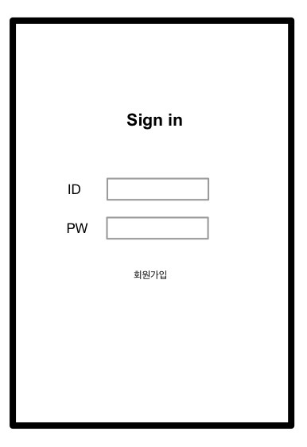
  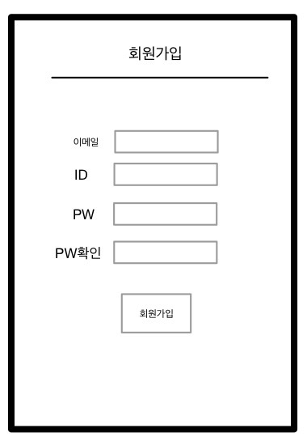

[4-1] 로그인화면 [4-2] 회원가입화면  
[4-1]은 앱을 실행했을 때 제일 먼저 나오는 화면으로 아이디와 비밀번호를 입력할 수 있는 로그인 화면이다.  
[4-2]는 [4-1]에서 회원가입 버튼을 눌렀을 때 나오는 화면으로 회원가입을 할 수 있다.  

  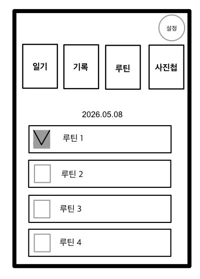
  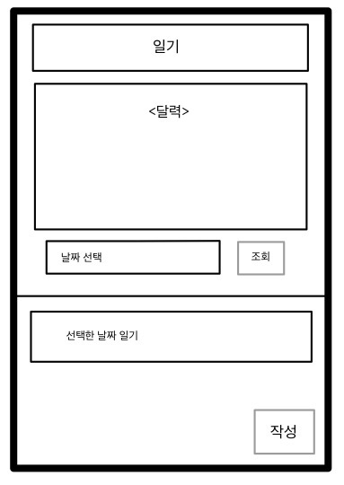

[4-3] 메인화면 [4-4] 일기메뉴 화면  
[4-3]은 로그인 후 나오는 화면으로 일기, 기록, 루틴, 사진첩 메뉴를 선택할 수 있다. 또 하단에 루틴 체크를 바로 할 수 있다.  
[4-4]는 [4-3]에서 일기 메뉴를 선택했을 때 화면으로 날짜를 선택하여 일기를 조회할 수 있으며 작성 버튼을 눌러 일기를 작성할 수 있다.  

  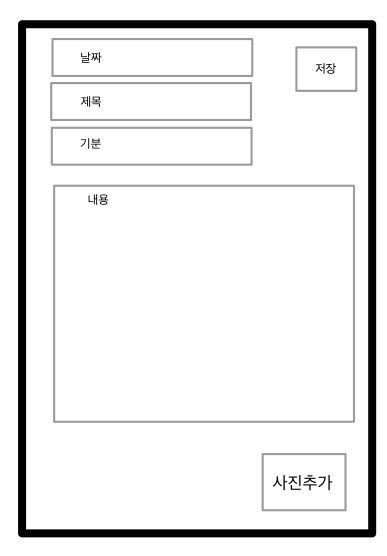
  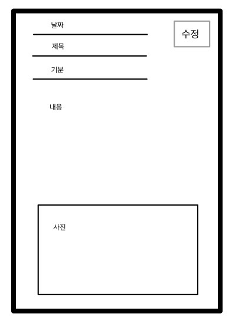

[4-5] 일기 작성 화면 [4-6] 일기 수정 화면  
[4-5]는 [4-4]에서 작성버튼을 눌렀을 때 나오는 화면으로 날짜, 제목, 기분, 내용을 적고 사진을 추가할 수 있다.  
[4-6]은 [4-3]에서 일기 선택을 한 후 수정버튼을 누르면 나오는 화면이다. 일기의 내용, 날짜 등을 수정할 수 있다.  

  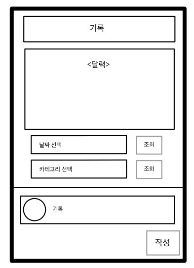
  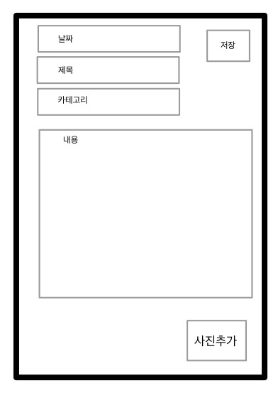
  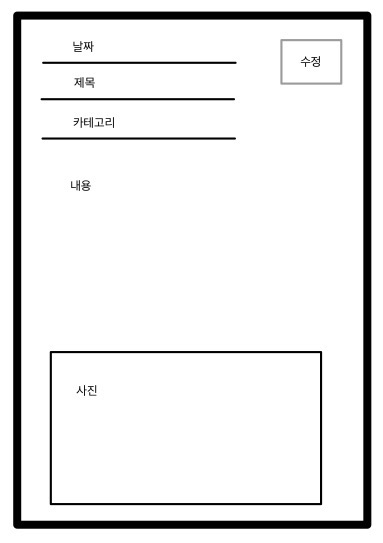

[4-7] 기록 메뉴 화면 [4-8] 기록 작성 화면 [4-9] 일기 수정 화면  
[4-7]은 [4-3]에서 기록 메뉴를 선택했을 때 나오는 화면으로 날짜나 카테고리를 선택하여 기록을 조회할 수 있다.  
[4-8]은 [4-7]에서 작성 버튼을 눌렀을 때 나오는 화면으로 날짜, 제목, 카테고리, 내용을 적고 사진을 추가할 수 있다.   
[4-9]는 [4-7]에서 기록을 선택한 후 수정버튼을 누르면 나오는 화면이다. 기록의 내용, 날짜 등을 수정할 수 있다.  

  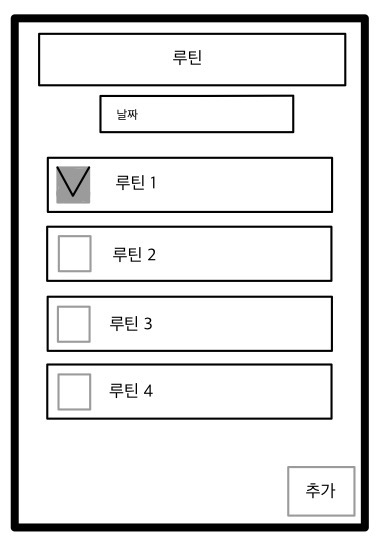
  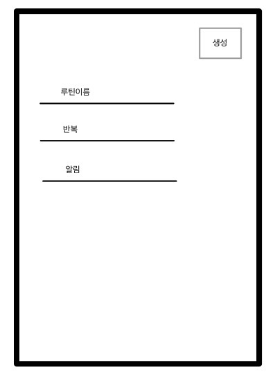
  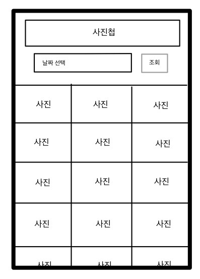

[4-10] 루틴 메뉴 화면 [4-11] 루틴 추가 화면 [4-12] 사진첩 메뉴 화면  
[4-10]은 [4-3]에서 루틴 메뉴를 선택하면 나오는 화면으로 오늘의 루틴을 확인하고 완료한 일을 체크할 수 있다.  
[4-11]은 [4-10]화면에서 추가 버튼을 눌렀을 때 나오는 화면으로 새로운 루틴을 추가할 수 있다.  
[4-12]는 [4-3]에서 사진첩 버튼을 누르면 나오는 화면으로 날짜를 선택하여 사진을 조회할 수 있다.   

  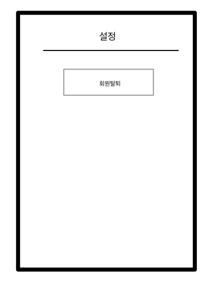
  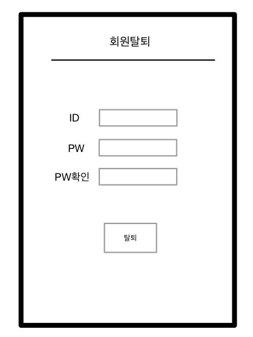

[4-13] 설정 화면           [4-14] 회원탈퇴 화면  
[4-13]은 [4-3]에서 설정버튼을 눌렀을 때 나오는 화면으로 회원탈퇴를 누를 수 있다.  
[4-14]는 [4-13]에서 회원탈퇴 버튼을 눌렀을 때 나오는 화면으로 아이디와 비밀번호를 누른 후 탈퇴할 수 있다.   

# 5. Glossary
|terms | Description |
|-|-|
|사용자 | 프로그램을 사용하는 사람|
|일기 | 하루의 일상을 저장하는 용도 |
|루틴 | 매일 해야할 일을 저장하는 용도 |
|루틴 체크| 루틴을 완료하고 체크하는 것|
|기록 | 책이나 영화, 맛집 등 남기고 싶은 것들을 저장하는 용도|
|인터페이스 | 사용자가 앱을 사용하는 화면|

# 6. References
