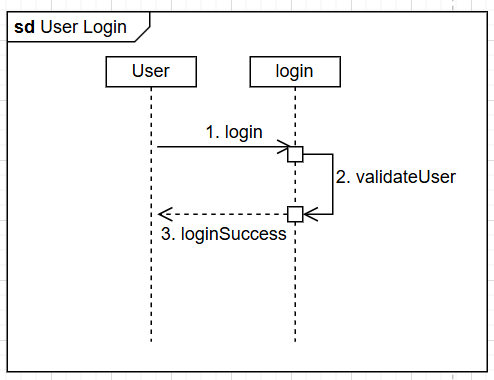
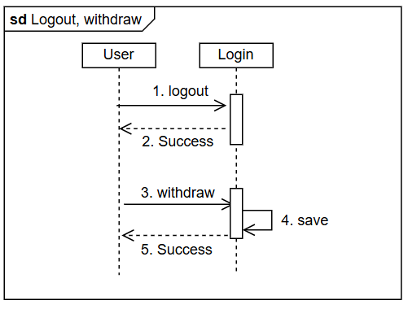
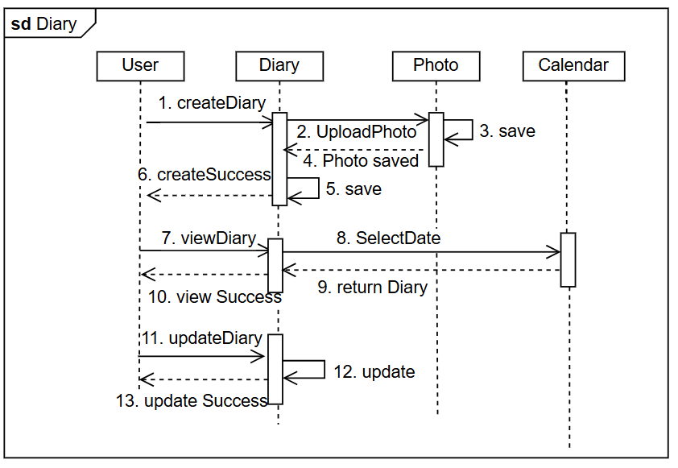
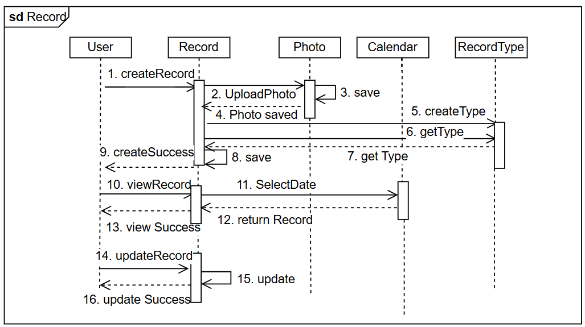
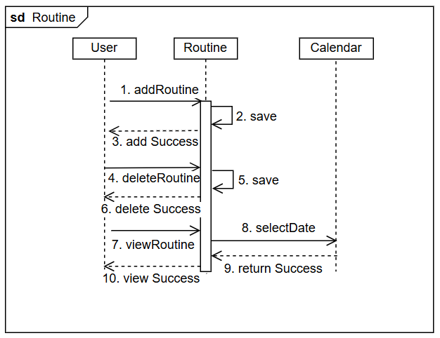
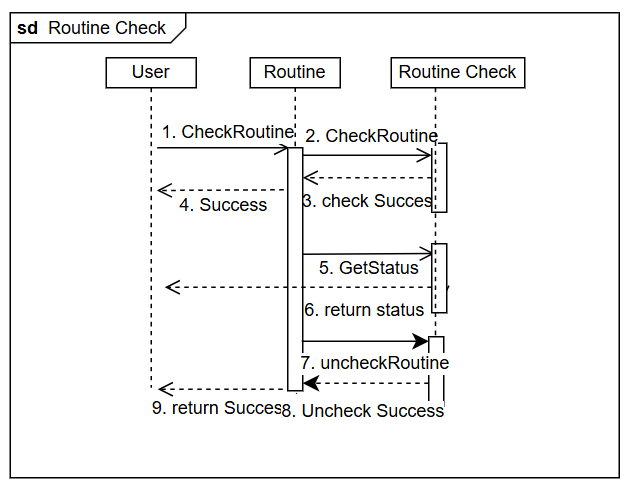
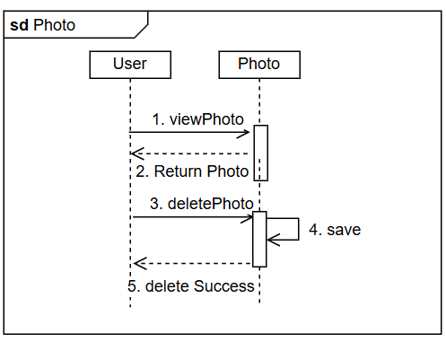
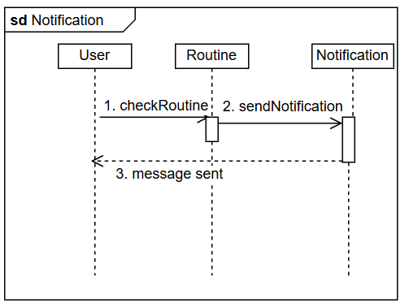

# 3. Design

<h2 align="center">
Mylog
</h2>

<!--logo-->

<h4 align="right">
22421702, 최유정, sayyj0406@yu.ac.kr
</h4>

---
<h3 align="center">
[Revision history] 
</h3>

|Revision date | Version # | Description | Author |
|-|-|-|-|
|06/05/2026| 0.00 | First Documentation | 최유정 |
---

<h3 align="center">
= Contents =
</h3>

1. Introduction
2. Class diagram
3. Sequence diagram
4. State machine diagram
5. Implementation requirements
6. Glossary
7. References

---
### 1. Introduction
최근 일상생활의 많은 부분이 디지털 환경으로 전환되면서, 아날로그 방식의 기록 문화는 점차 감소하는 추세를 보이고 있다. 이에 따라 일기나 루틴등 개인 기록을 꾸준히 기록하고 관리하는 것이 점점 어려워지고 있다. 이러한 변화 속에서, 개인의 기록들을 보다 효율적이고 편리하게 관리할 수 있는 디지털 도구가 필요하다 생각되어 다양한 기록을 한 번에 관리할 수 있는 디지털 기록 프로그램을 만들고자 한다.

본 문서는 Analysis 단계의 문서를 바탕으로 작성된 Design 단계의 문서로 시스템 구조와 동작을 구체화시키기 위해 Class diagram, Sequence diagram, State machine diagram을 제시하며 구현을 위한 요구사항을 포함한다.

### 2. Class diagram
<!--classdiagramimage-->

아래는 클래스 설명으로 가독성을 위해 함수의 이름과 변수명만 표기하였다.

|1. Login|
|-|
|operation|
|login : 사용자 정보 확인하여 로그인|
|logout : 현재 로그인 된 사용자 로그아웃 |
|validateUser : 입력한 사용자 정보가 올바른지 확인|

|2. User|
|-|
|attribute|
|UserID : 사용자 번호|
|email : 이메일 |
|password : 비밀번호 |
|operation|
|withdraw :  사용자 계정 삭제 및 회원탈퇴|

|3. Diary|
|-|
|attribute|
|diaryId : 다이어리 번호|
|title : 제목|
|content : 내용|
|createdDate : 생성 날짜|
|mood : 기분|
|operation|
|createDiary : 새로운 일기 작성하여 저장|
|updateDiary : 기존 일기 내용 수정하여 저장|
|viewDiary : 저장된 일기 조회|

|4. Photo|
|-|
|attribute|
|photoId : 사진 번호|
|filepath : 사진 저장 경로|
|uploadDate : 업로드 날짜|
|operation|
|uploadPhoto : 사진 업로드|
|viewPhoto : 저장된 사진 조회|
|deletePhoto : 선택한 사진 삭제|

|5. Record|
|-|
|attribute|
|recordId 기록 번호|
|content : 내용|
|date : 날짜|
|operation|
|createRecord : 새로운 기록 작성하여 저장|
|updateRecord : 기존 기록 내용 수정하여 저장|
|viewRecord : 저장된 기록 조회|

|6. RecordType|
|-|
|attribute|
|typeId : 타입 번호|
|typeName : 타입 이름|
|operation|
|createType : 새로운 기록 카테고리 생성|
|updateType : 기존 카테고리 정보 수정 |
|getType : 카테고리 정보 조회|

|7. Routine|
|-|
|attribute|
|routineId : 루틴 번호|
|routineName : 루틴 이름|
|operation|
|addRoutine : 새로운 루틴 등록|
|checkRoutine : 기존 루틴 정보 수정|
|deleteRoutine : 루틴 삭제|
|viewRoutine : 등록된 루틴 조회|

|8. RoutineCheck|
|-|
|attribute|
|checkID : 체크번호|
|date : 날짜|
|isCompleted : 완료 여부|
|operation|
|checkRoutine : 루틴 수행 여부 체크|
|uncheckRoutine : 완료된 루틴을 미완료로 변경|
|getStatus : 루틴 수행 상태 조회|

|9. Calendar|
|-|
|attribute|
|selectDate : 선택 날짜|
|operation|
|selectDate : 조회할 날짜 선택|
|viewMonthly : 월별 조회|
|viewDaily : 날짜 조회|

|10. Notification|
|-|
|attribute|
|notificationID : 알림 번호|
|message : 알림 메세지|
|sendTime : 알림 시간|
|operation|
|sendNotification : 사용자에게 알림 메세지 전송|
|deleteNotification : 저장된 알림 삭제|

### 3. Sequence diagram
아래는 앱의 주요 동작 기능 Sequence Diagram으로 나타낸 것이다. 

---

Login 기능으로 시스템이 시작된다. 사용자가 로그인 정보를 입력하고 로그인 버튼을 누르면 validateUser에서 로그인을 시도한다. 로그인에 성공하면 성공메세지가 출력된다.

---

Logout 기능은 사용자가 로그아웃을 요청하면 로그아웃이 된다. withdraw 기능은 회원탈퇴 기능으로 사용자가 정보를 넣고 회원탈퇴를 요청하면 계정이 삭제된 후 로그아웃 된다.

---

Diary에 대한 기능들로 createDiary는 사용자가 create 버튼을 누르면 사진 업로드와 내용 저장이 가능하다.
view Diary를 선택하면 날짜를 선택한 후 검색한 정보가 반환된다.
updateDiary는 정보를 수정하는 것으로 사용자가 수정을 하면 저장된 후 수정완료 메세지가 출력된다.

---

Record에 대한 기능들로 createRecord는 사용자가 create버튼을 누르면 사진과 내용, Record Type에 대해 적고 저장할 수 있다.
view Record는 저장된 내용을 검색하는 기능으로 사용자가 날짜를 선택하면 선택한 날짜의 Record를 볼 수 있다.
updateRecord는 정보를 수정하는 것으로 사용자가 수정을 하면 저장된 후 수정 완료 메세지가 출력된다.

---

루틴에 관한 내용으로 addRoutine을 통해 새로운 루틴을 추가할 수 있다. deleteRoutine을 통해서는 현재 루틴을 삭제할 수 있으며 viewRoutine을 통해 하루의 루틴 완료 현황을 조회할 수 있다.

---

루틴을 완료했을 때 사용하는 기능으로 사용자가 루틴 완료를 체크하면 checkRoutine으로 가 완료 내용이 저장된 후 완료 메세지가 출력된다.
getStatus는 루틴 완료 여부를 조회하는 것으로 루틴 완료 여부를 출력한다.
uncheckRoutine은 완료된 루틴을 취소하는 것으로 취소된 화면이 나타나게 된다.

---

photo에 대한 기능들로 저장된 사진을 조회하고 삭제할 수 있다.

---

알림에 관한 것을 현재 루틴 완료 여부를 체크한 후 사용자에게 루틴 알림 메세지가 전송된다.

### 4. State machine diagram

본 State Machine Diagram은 사용자가 앱을 실행하여 사용하는 과정에서 발생하는 상태 변화를 나타낸다.   

로그인 화면에서 회원가입 버튼을 누르면 회원가입 화면으로 이동하여 회원가입을 진행한다. 회원가입이 완료되면 로그인 화면으로, 회원가입에 실패하면 회원가입 화면에 남아있게 된다.   

로그인 화면에서 로그인을 성공하면 메인화면으로 넘어가게 되고, 로그인에 실패하면 로그인 화면에 남아있게 된다.   

메인화면에서 daily log, record log, routine log, photo gallery를 선택할 수 있고 하나의 log를 선택하게 되면 해당하는 log 화면으로 넘어가게 된다.   

daily log, record log, routine log의 메인화면으로 넘어가서 create, update 버튼을 누르게 되면 edit log 화면으로 넘어가 내용을 작성, 수정할 수 있다. 작성, 수정이 끝난 후 저장에 성공하면 각 log의 메인화면으로 돌아가고, 실패할 경우 edit 화면에 남아있게 된다.   

routine log 화면에서는 루틴을 삭제, 체크할 수 있다.    

각 log 메인 화면에서 조회 버튼을 누르게 되면 각 log를 조회 화면으로 넘어가 조회할 수 있다.   

메인화면에서 설정 버튼을 누르면 setup 화면으로 넘어가게 되고 설정에서 회원탈퇴 버튼을 누르면 회원탈퇴가 진행된다.

### 5. Implementation requirements
안드로이드 10 이상을 지원하는 스마트폰에서 동작 가능하다.

### 6. Glossary
|terms | Description |
|-|-|
|사용자 | 프로그램을 사용하는 사람|
|일기 | 하루의 일상을 저장하는 용도 |
|루틴 | 매일 해야할 일을 저장하는 용도 |
|루틴 체크| 루틴을 완료하고 체크하는 것|
|기록 | 책이나 영화, 맛집 등 남기고 싶은 것들을 저장하는 용도|
|인터페이스 | 사용자가 앱을 사용하는 화면|

### 7. References
